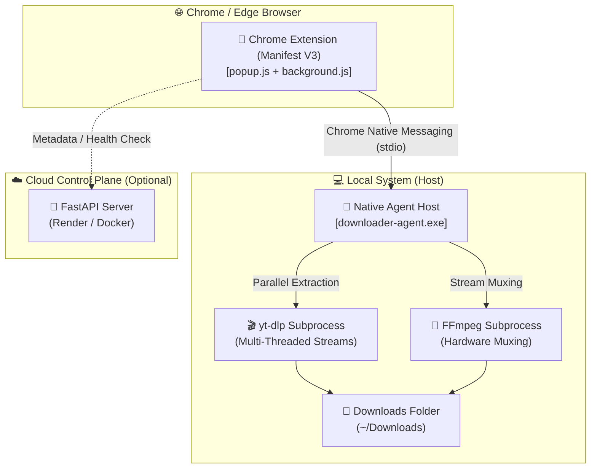
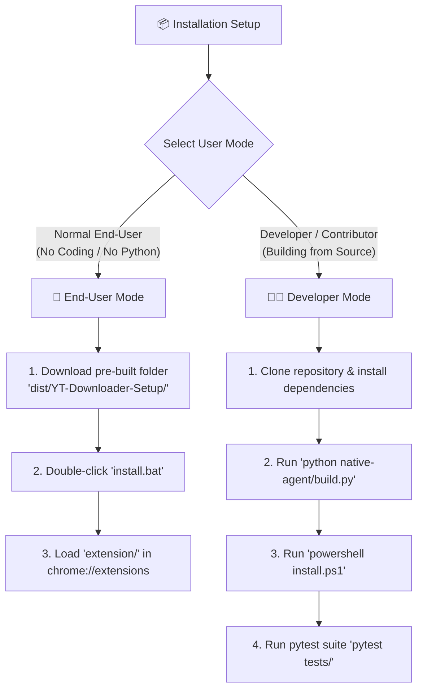

# 🎬 YT Downloader Pro 2.1: Native Agent Architecture & Browser Extension

[](LICENSE)
[](extension/)
[](native-agent/)

A high-performance YouTube video & audio downloader suite combining a **Chrome/Edge Extension (Manifest V3)** with an invisible **Native Messaging Downloader Agent (`downloader-agent.exe`)** and a **FastAPI Cloud Control Plane**.

Supports resolutions up to **4K Ultra HD @ 60 FPS**, **2K Quad HD**, **1080p Full HD**, and high-bitrate **320 kbps MP3 Audio** extraction.

---

> [!IMPORTANT]
> **Can users download ONLY `dist/` and `extension/` folders? YES! 100% Standalone!**  
> End-users do **NOT** need the full source code repo or Python runtime. They only need **2 folders**:
> 1. 📁 [`dist/YT-Downloader-Setup/`](dist/YT-Downloader-Setup/) — Pre-compiled setup containing `install.bat`, `downloader-agent.exe`, and `ffmpeg.exe`.
> 2. 🧩 [`extension/`](extension/) — Chrome/Edge Manifest V3 extension folder.

---

## 🌟 Key Features in v2.1

- 🤖 **Invisible Native Messaging Agent**: Communicates directly via Chrome/Edge stdio Native Messaging—no manual terminal required!
- ⚡ **Instant 1-Click Automated Installer**: Runs `install.bat` / `install.ps1` to register host in Windows Registry automatically.
- 🎬 **Up to 4K / 8K Ultra HD**: Multi-threaded parallel downloading (`yt-dlp` engine) with hardware-accelerated **FFmpeg** audio/video stream muxing.
- 🎵 **High-Fidelity Audio Extraction**: Support for 320 kbps, 192 kbps, and 128 kbps MP3 audio bitrates.
- 📊 **Monotonic Progress Tracking & Live Status Badges**: Monotonically smooth 0% → 100% progress bar with live status stage tags (`EXTRACTING`, `DOWNLOADING`, `AUDIO STREAM`, `PROCESSING`, `COMPLETED`).
- 🖼️ **Guaranteed High-Res Thumbnail Extraction**: Extracts high-resolution video thumbnails, video titles, channel names, and durations in <5ms.
- 📁 **Queue & Playlist Batch Manager**: Download individual videos or complete YouTube playlists sequentially.
- 📜 **Persistent Download History**: View past downloads with timestamps, status pills, hover tooltips, and 1-click retry functionality.
- 🔄 **Reactive State Sync & Manual Refresh (↺)**: `chrome.storage.onChanged` real-time sync + manual refresh button for instant UI state updates.
- 🛡️ **Safe Downloads**: Output restricted to `%USERPROFILE%\Downloads` with command injection sanitization.

---

## 🏗️ System Architecture Overview



---

## 📦 Installation Guide: 2 User Perspectives

Select your installation mode below based on whether you are a **Normal End-User** or a **Developer / Contributor**:



---

### 👤 Mode A: Normal End-User Setup (Download ONLY 2 Folders — No Python Needed)

> **Goal:** End users only need **2 folders** from the release zip: `dist/YT-Downloader-Setup/` and `extension/`.

#### Tagged Files Needed for End-Users:
- 📁 [`dist/YT-Downloader-Setup/`](dist/YT-Downloader-Setup/): Pre-built standalone installer distribution folder.
  - ⚙️ [`install.bat`](dist/YT-Downloader-Setup/install.bat): 1-Click Registry installer script.
  - 🚀 `downloader-agent.exe`: Pre-compiled standalone Native Messaging executable.
  - 🎬 `ffmpeg.exe`: Pre-compiled FFmpeg hardware post-processor binary.
  - 📄 `com.omikalix.ytdownloader.json`: Native Messaging manifest template.
- 🧩 [`extension/`](extension/): Chrome/Edge Manifest V3 extension directory.

#### Installation Steps for End-Users:

1. **Download the 2 Folders**:
   Download or extract **`dist/YT-Downloader-Setup/`** and **`extension/`** to any location on your PC.

2. **Run `install.bat`**:
   Open **`dist/YT-Downloader-Setup/`** and double-click **`install.bat`**.  
   *The script automatically copies `downloader-agent.exe` & `ffmpeg.exe` to `%LOCALAPPDATA%\YTDownloader` and registers Windows Registry keys for Chrome and Edge.*

3. **Load Extension**:
   - Open **Chrome** (`chrome://extensions`) or **Edge** (`edge://extensions`).
   - Enable **Developer mode** (toggle switch in top-right corner).
   - Click **Load unpacked** and select the **`extension/`** folder.

4. **Done!**:
   Navigate to any YouTube video and click **Download Now**!

---

### 👨‍💻 Mode B: Developer & Contributor Setup (Full Repo & Building from Source)

> **Goal:** Developers who want to modify Python agent logic, test custom features, or re-compile release binaries.

#### Tagged Files Needed for Developers:
- 🐍 [`native-agent/`](native-agent/): Python Native Messaging Agent source code.
  - 🔨 [`native-agent/build.py`](native-agent/build.py): PyInstaller build script.
  - ⚙️ [`native-agent/src/messaging/handler.py`](native-agent/src/messaging/handler.py): stdio request router.
  - 🎬 [`native-agent/src/downloader/ytdlp.py`](native-agent/src/downloader/ytdlp.py): yt-dlp & FFmpeg execution engine.
- 📜 [`installer/scripts/install.ps1`](installer/scripts/install.ps1): Automated PowerShell installer & registry script.
- ☁️ [`cloud/`](cloud/): FastAPI Cloud Control Plane service.
- 🧪 [`tests/`](tests/): Automated Pytest test suite.

#### Build & Setup Steps for Developers:

1. **Clone Repository & Navigate**:
   ```bash
   git clone https://github.com/OMI-KALIX/youtube-downloader-extension.git
   cd youtube-downloader-extension
   ```

2. **Install Python Dependencies**:
   ```bash
   pip install pyinstaller yt-dlp fastapi uvicorn pytest
   ```

3. **Build PyInstaller Binary**:
   ```bash
   python native-agent/build.py
   ```
   *Creates binary output at:* `native-agent/dist/downloader-agent.exe`

4. **Register Host & Package Installer**:
   ```bash
   python installer/build_installer.py
   powershell -ExecutionPolicy Bypass -File .\installer\scripts\install.ps1
   ```

5. **Load Extension & Run Tests**:
   - Load unpacked [`extension/`](extension/) folder in `chrome://extensions`.
   - Run pytest suite:
     ```bash
     pytest tests/
     ```

---

## 📖 Comprehensive User Guide

### 📥 Downloading Videos & High-Quality Audio

1. **Load Video Metadata**:
   - Open any YouTube video page in your browser. The extension automatically detects the active tab!
   - Alternatively, paste any video or playlist link (e.g. `https://www.youtube.com/watch?v=...` or `https://youtu.be/...`) into the input box and click **Load**.
   - High-res thumbnail image, actual video title, and channel name render immediately (<5ms).

2. **Select Resolution or Audio Format**:
   Open the **Select Quality / Format** dropdown to pick your output:
   - 🎬 **4K Ultra HD (2160p)** (~400-800 MB)
   - 🎬 **2K Quad HD (1440p)** (~200-400 MB)
   - 🎬 **Full HD (1080p)** (~80-150 MB)
   - 🎬 **HD (720p)** (~30-60 MB)
   - 🎵 **320 kbps High Quality MP3** (~8-12 MB)
   - 🎵 **192 kbps Medium Quality MP3** (~5-7 MB)
   - 🎵 **128 kbps Standard Quality MP3** (~3-4 MB)

3. **Start Download**:
   - Click **Download Now**.
   - Progress bar animates instantly to **1%** (`CONNECTING TO YOUTUBE`).
   - Real-time progress percentage, download speed (e.g. `12.5 MB/s`), ETA, and stage badges (`EXTRACTING`, `DOWNLOADING`, `AUDIO STREAM`, `PROCESSING`, `COMPLETED`) update smoothly.

---

### ⏸️ Managing Active Downloads

- **Pause / Resume**: Click **Pause** (⏸️) to temporarily pause stream fetching, and **Resume** (▶️) to continue.
- **Cancel Download**: Click **Cancel** (❌) to terminate the active download process on disk immediately.
- **Refresh State (↺)**: Click the **Refresh Button (↺)** in the top navigation header anytime to force-sync agent status and progress.

---

### 📜 Using Download History & Retries

1. Click the **History Tab (📜)** in the top header.
2. View your past download queue with timestamps and distinct glowing status badges:
   - 🟢 **`COMPLETED`**: Download finished and merged successfully.
   - 🔴 **`DOWNLOADING`**: Currently fetching fragments.
   - 🟠 **`CANCELLED`**: Cancelled by user.
   - 🔴 **`FAILED`**: Network or format error.
3. **Hover Full Title**: Hover your mouse over any video card title to reveal the full video name in a native tooltip.
4. **1-Click Retry**: Click the **Retry** button next to any history item to immediately re-queue and re-download that video.
5. **Clear History**: Click **Clear History** to purge saved history records.

---

### 📁 Where Are Files Saved?

All downloaded videos and audio MP3 files are automatically saved to your system's default **Downloads folder**:
```text
C:\Users\<YourUsername>\Downloads\
```
*Filename format:* `Title [VideoID].mp4` or `Title [VideoID].mp3`

---

## 📡 Cloud Control API (`cloud/`)

The cloud control plane provides fast REST endpoints for versioning and metadata extraction:

| Endpoint | Method | Description |
| :--- | :--- | :--- |
| `/health` | GET | Health check endpoint returning status 200 OK |
| `/version` | GET | Current agent version metadata (`v2.1.0`) |
| `/config` | GET | Agent configuration parameters |
| `/agent/latest` | GET | Returns latest agent download URL and SHA-256 hash |
| `/api/v1/metadata` | GET | Fast metadata extraction returning title, uploader, thumbnail, duration |

---

## 🛠️ Troubleshooting & FAQs

| Issue | Cause | Solution |
| :--- | :--- | :--- |
| **"Native agent offline" banner** | Native Host manifest not registered in Registry | Double-click `install.bat` in `dist/YT-Downloader-Setup/` and click Reload (↺) in `chrome://extensions`. |
| **Download stuck at 2%** | Format syntax collision on custom heights | Resolved in v2.1. Re-run `install.bat` to update executable. |
| **History showing generic titles** | Slow metadata response | Resolved in v2.1 using instant oEmbed lookup (<100ms). |

---

## 📁 Repository Structure

```
youtube-downloader-extension/
├── .github/                   # GitHub Actions Workflows & CI automation
├── cloud/                     # FastAPI Cloud Control Plane service & Dockerfile
├── dist/                      # YT-Downloader-Setup installer distribution
├── docs/                      # Technical documentation & Native Messaging specs
├── extension/                 # Chrome / Edge Extension (Manifest V3 - v2.1.0)
│   ├── manifest.json          # Extension Manifest V3 spec (Deterministic Key)
│   ├── background/            # Service worker & message routing
│   ├── native/                # Native messaging client wrapper
│   ├── popup/                 # Glassmorphic UI & Popup controller
│   └── utils/                 # Cookie export utilities
├── installer/                 # 1-Click PowerShell installer scripts & host manifest
├── native-agent/              # Standalone Python Native Messaging Agent (v2.1.0)
│   ├── src/downloader/        # yt-dlp & FFmpeg subprocess runners
│   ├── src/jobs/              # Job state machine & queue manager
│   ├── src/messaging/         # stdio length-prefixed framing protocol
│   └── build.py               # PyInstaller executable builder
├── tests/                     # Automated pytest test suite
├── LICENSE                    # MIT License
└── README.md                  # Master project documentation & User Guide
```

---

## 📄 License

Distributed under the [MIT License](LICENSE).
