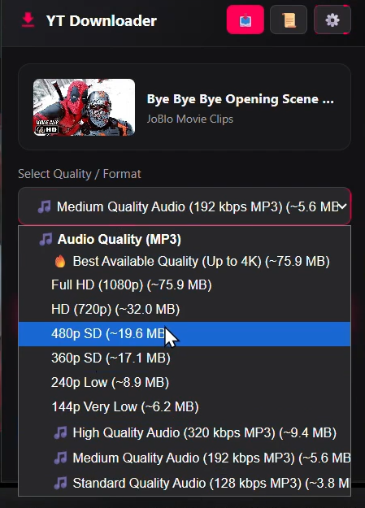

# 🎬 Youtube Downloader: Extension With Native Desktop Server

[](LICENSE)
[](extension/)
[-blue?logo=google-drive)](https://drive.google.com/file/d/YOUR_GOOGLE_DRIVE_FILE_ID/view?usp=sharing)

A ultra high-performance YouTube video & audio downloader suite combining a **Chrome/Edge Extension (Manifest V3)** with a **Standalone Portable Desktop Backend Executable (`Downloader_v1.exe`)**. Supports resolutions up to **4K / 8K Ultra HD @ 60 FPS** and high-bitrate **320 kbps MP3 Audio** extraction.

---

> [!IMPORTANT]
> ### ⬇️ Download Portable Desktop Server Executable
> To run the backend service without installing Python or setting up dependencies, download the pre-built single-file executable from Google Drive:
> 
> 👉 **[Download Downloader Server EXE (Google Drive)](https://drive.google.com/file/d/10Kgl-Xfn6Km09JjzfPTLb9RpeOJU4QLt/view?usp=sharing)**

---

## WalkThrough
<p align="center">
  <a href="./assets/YT-Downloader-2.0.mp4">
    
  </a>
</p>

<p align="center">
  <b>▶ Click the image above to watch the demo</b>
</p>

## 🌟 Key Features

- ⚡ **Native YouTube UI Injection**: Injects a sleek, dark-themed **Download** button directly into YouTube's player action bar next to Like/Share buttons.
- 🚀 **100% Residential IP Reliability**: Runs locally on your machine—completely immune to YouTube's datacenter IP bans and `HTTP 429 Too Many Requests` errors.
- 📺 **Up to 4K / 8K Ultra HD**: Multi-threaded parallel downloading (`yt-dlp` engine) with hardware-accelerated **FFmpeg** audio/video stream muxing.
- 🎵 **320 kbps High-Bitrate MP3 Extraction**: High-fidelity audio processing with automated ID3 tag extraction.
- 🍪 **Automatic Session Cookie Exporter**: Seamlessly passes active YouTube session cookies for private, restricted, or member-only video downloads without manual login.
- 🖥️ **System Tray Native Desktop Integration**: Runs silently in the background with a Windows tray icon (`pystray`) for quick access to download folders, settings, and logs.
- 📦 **Portable Standalone Executable**: No Python or dependencies required for end-users! Simply run `Downloader_Server.exe`.

---

## 🏗️ Architecture Overview

```
┌────────────────────────────────────────────────────────────────────────┐
│                        USER'S LOCAL COMPUTER                           │
│                                                                        │
│  ┌──────────────────────────────┐        HTTP API (127.0.0.1:8000)    │
│  │  Chrome / Edge Extension     ├──────────────────────────┐           │
│  │  (Manifest V3 + Injected UI) │                          │           │
│  └──────────────────────────────┘                          ▼           │
│                                           ┌──────────────────────────┐ │
│                                           │ Downloader Server EXE    │ │
│                                           │ (Downloader_Server.exe)      │ │
│                                           │ FastAPI + yt-dlp + FFmpeg│ │
│                                           └────────────┬─────────────┘ │
│                                                        │               │
│                                                        ▼               │
│                                             Downloads Folder (~/Downloads)
└────────────────────────────────────────────────────────────────────────┘
```

For the complete architectural evolution and past iterations (Cloud containers, Client-side WASM, etc.), read [PROJECT_HISTORY.md](PROJECT_HISTORY.md).

---

## 🚀 Quick Start Guide

### 1. Download & Run Desktop Server EXE

1. Click **[Download Downloader Server EXE (Google Drive)](https://drive.google.com/file/d/10Kgl-Xfn6Km09JjzfPTLb9RpeOJU4QLt/view?usp=sharing)** to download `Downloader_Server.exe`.
2. Double-click `Downloader_Server.exe` to launch the background local server (`http://127.0.0.1:8000`). It will run quietly in your Windows System Tray.

### 2. Load Browser Extension

1. Open Chrome or Microsoft Edge and navigate to `chrome://extensions` or `edge://extensions`.

2. Enable the **Developer mode** toggle in the top-right corner.

3. Install the extension using either of these methods:
   - **Recommended:** Download the latest release and load only the extension folder. No need to clone the repository.
   - **Development:** Click **Load unpacked** and select the `extension/` directory from this repository.

4. Open any YouTube video and click the injected **Download** button to instantly download videos in up to **4K** or audio in up to **320 kbps MP3**.
---

## 📁 Repository Structure

```
YT-Downloader-2.0/
├── .github/                   # GitHub Actions Workflows & CI automation
├── extension/                 # Chrome / Edge Extension (Manifest V3)
│   ├── manifest.json          # Extension Manifest V3 spec
│   ├── background/            # Service worker & background message routing
│   ├── content/               # Injected YouTube watch page UI button & modal
│   ├── popup/                 # Toolbar extension popup UI & settings
│   └── utils/                 # Netscape cookie converter
├── .gitignore                 # Git ignore rules
├── CODE_OF_CONDUCT.md         # Open-source community guidelines
├── Dockerfile                 # Docker container setup (optional cloud deployment)
├── LICENSE                    # MIT License
├── PROJECT_HISTORY.md         # Complete chapterwise project history & evolution
├── README.md                  # Master project documentation & setup guide
├── TROUBLESHOOTING.md         # FAQ & troubleshooting guide
├── config.json                # Extension configuration parameters
└── render.yaml                # Render cloud deployment blueprint
```

> 💡 **Note on Desktop App Binary**: The pre-compiled standalone Windows Desktop App (`Downloader_Server.exe`) is hosted on **[Google Drive](https://drive.google.com/file/d/10Kgl-Xfn6Km09JjzfPTLb9RpeOJU4QLt/view?usp=sharing)** for 1-click instant setup without requiring Python or PyInstaller builds.

---

## 📖 Chapterwise Project History & Failures

Curious about how this project was designed? Read our chapter-by-chapter history document:
- 📖 [PROJECT_HISTORY.md](PROJECT_HISTORY.md)
  - **Chapter 1**: Pure Extension & Client-Side WebAssembly (WASM OOM & DASH splitting issues)
  - **Chapter 2**: Cloud Backend Service (YouTube Datacenter IP 429 Bans & Cold Starts)
  - **Chapter 3**: Hybrid Client Stream Link Resolution (IP-Bound 403 Forbidden errors)
  - **Chapter 4**: Final Solution (Chrome Extension + Local Portable Desktop App)

---

## 📄 License & Community

- **License**: [MIT License](LICENSE)
- **Code of Conduct**: [CODE_OF_CONDUCT.md](CODE_OF_CONDUCT.md)
- **Troubleshooting**: [TROUBLESHOOTING.md](TROUBLESHOOTING.md)
